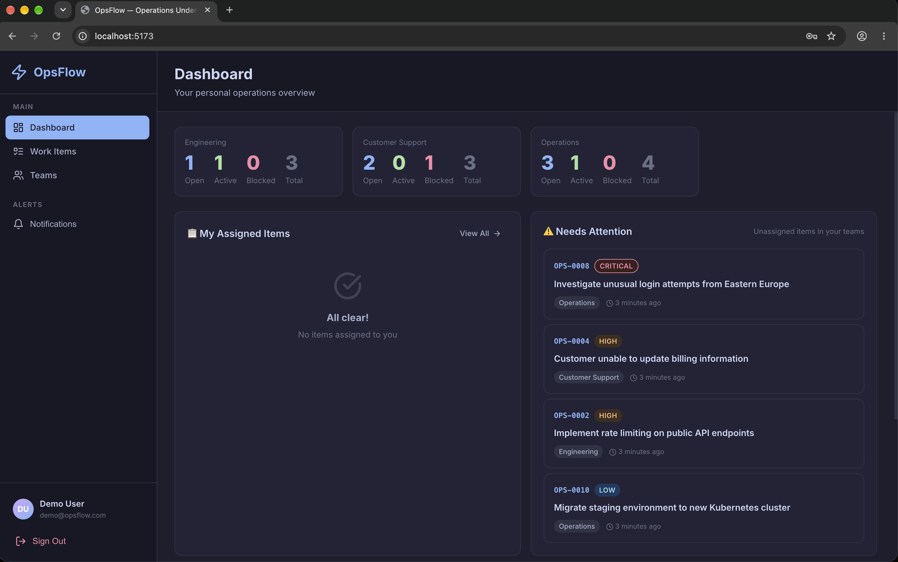
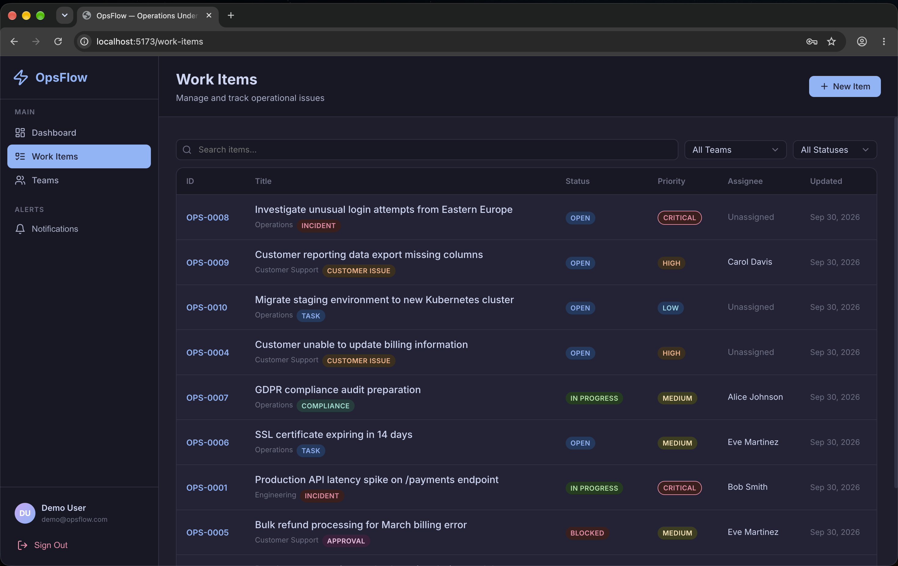
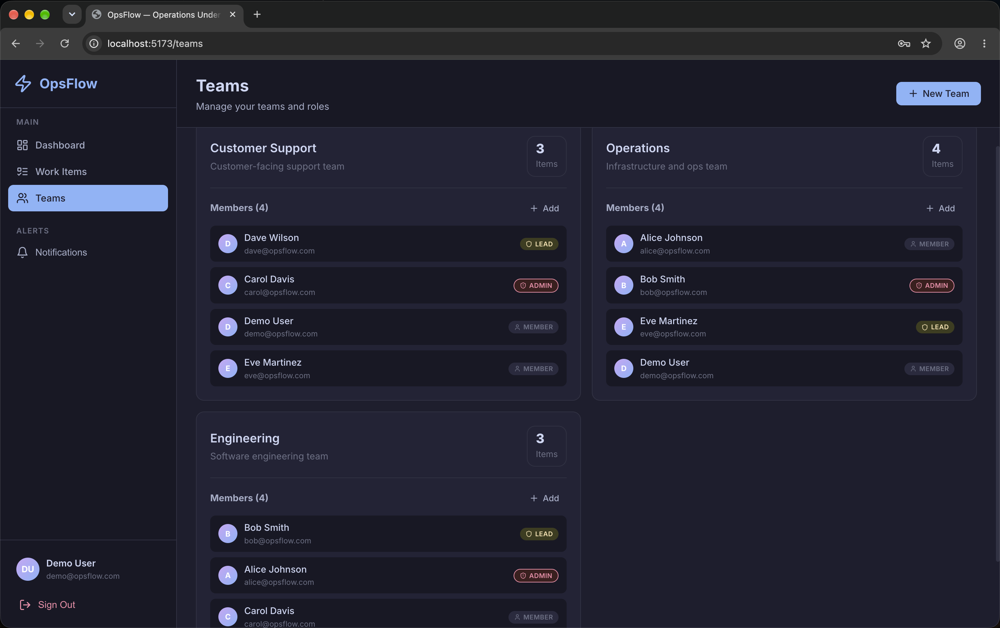
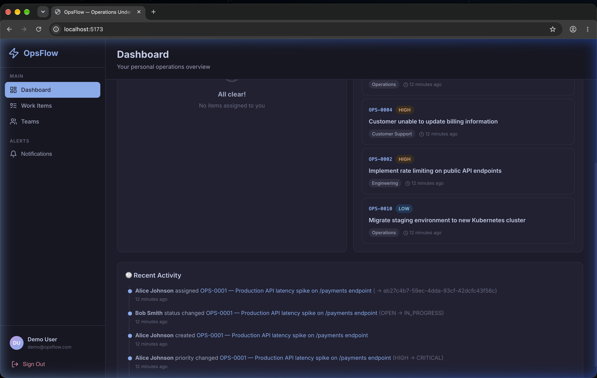
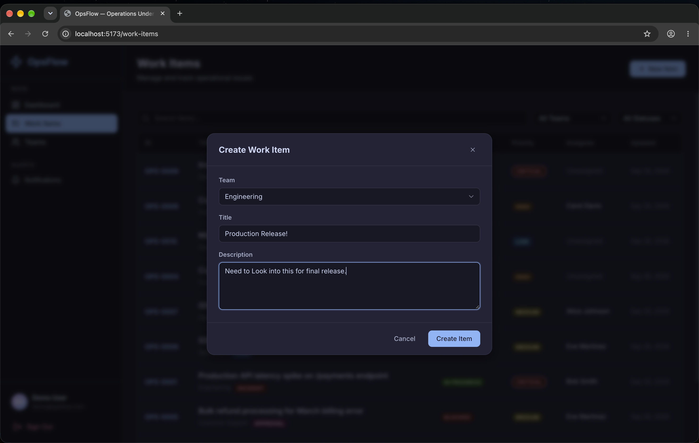
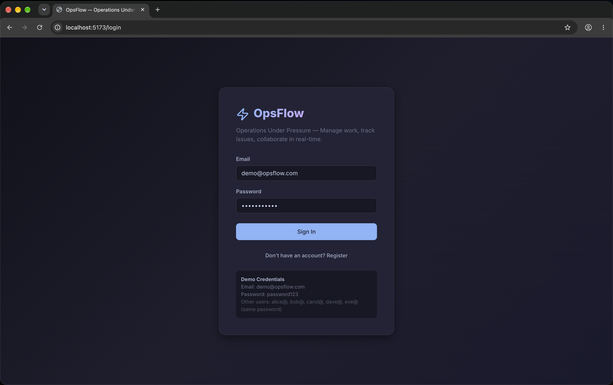
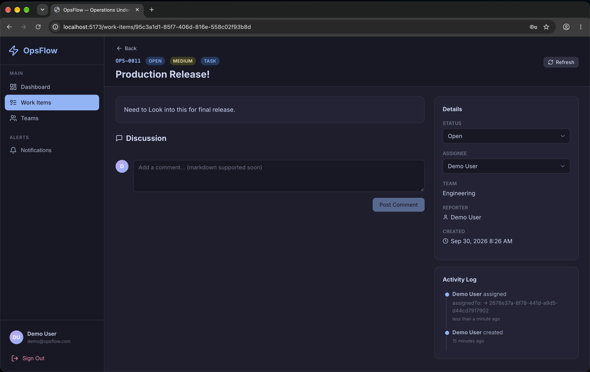
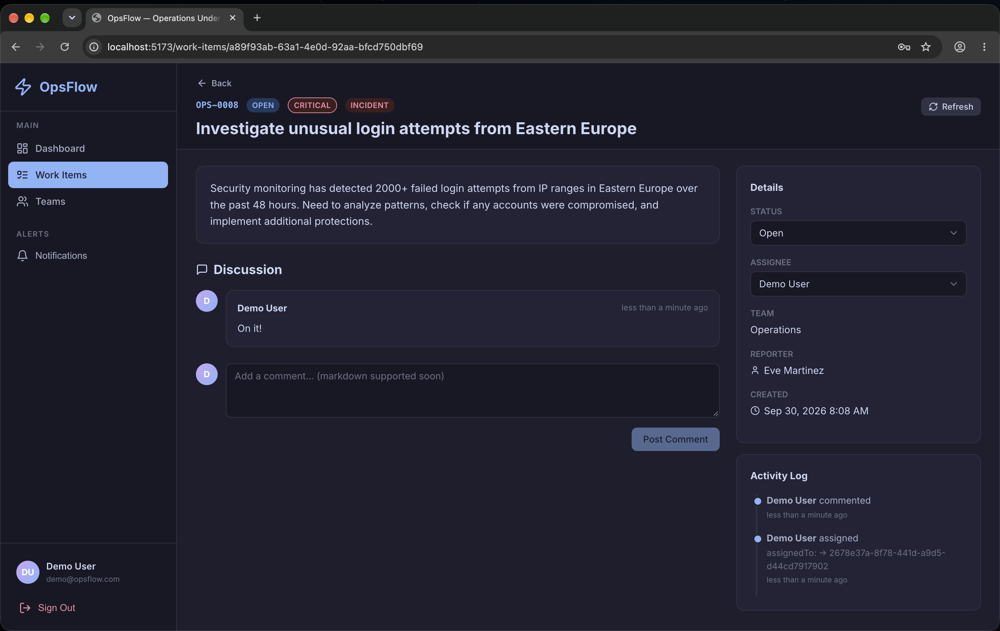

# OpsFlow — Operations Under Pressure ⚡️

OpsFlow is a scalable, real-time operational work management platform designed for high-stakes, high-concurrency environments. Built with a focus on strict state validation, optimistic concurrency control, and AI-assisted workflows, OpsFlow ensures operations teams can manage critical incidents without collisions, duplicate work, or data inconsistencies.

## 🚀 Key Features & Architectural Decisions

### 1. Optimistic Concurrency Control (Lost Update Prevention)
When multiple operations agents attempt to update the same critical work item simultaneously, the last one to click "Save" shouldn't blindly overwrite the others. 
* **Implementation:** Implemented via a `version` integer on the Prisma Schema. The frontend passes the known version to the backend, which executes an atomic `UPDATE ... WHERE id = X AND version = Y`. If the version mismatches, the database throws a `409 Conflict`, and the UI gracefully warns the user to refresh.

### 2. Idempotency (Duplicate Request Prevention)
Network timeouts happen, and users double-click buttons. 
* **Implementation:** Redis-based idempotency middleware caches responses using an `Idempotency-Key` header from the frontend. Concurrent duplicate requests are halted with a `409 DUPLICATE_IN_PROGRESS`, while subsequent retry requests simply receive the exact cached response of the initial successful execution (e.g., a `201 Created`) without hitting the database again.

### 3. Strict State Machine Validation
A ticket cannot jump from `OPEN` straight to `RESOLVED` without going through `IN_PROGRESS`.
* **Implementation:** A centralized, deterministic state machine utility on the Node.js server strictly validates all workflow transitions before hitting the database, rejecting invalid paths with `422 Unprocessable Entity` errors.

### 4. Real-time Collaboration & Presence
* **Implementation:** Integrated **Socket.IO** with Redis pub/sub adapter. When a user opens a ticket, it broadcasts a "viewing presence" event, alerting other agents in real-time that a colleague is currently reviewing the same ticket to prevent duplicated effort.

### 5. AI-Powered Triage & Intelligence Layer
* **Implementation:** An asynchronous intelligence layer utilizing the **Gemini AI SDK**. When new tickets are created, background jobs (via **BullMQ**) automatically triage the content, suggesting proper priority levels (e.g., escalating a ticket to `CRITICAL` if "server crash" is detected) and providing summarized action plans directly on the ticket. Graceful degradation ensures the system remains fully functional even if the AI service fails.

---

## 🛠️ Technology Stack
* **Frontend:** React 18, Vite, TypeScript, React Query (for robust caching and optimistic UI), Socket.IO Client.
* **Backend:** Node.js, Express, TypeScript.
* **Database:** PostgreSQL (with `pgvector` for future semantic search), managed via Prisma ORM.
* **Caching & Queues:** Redis, BullMQ (for async AI processing and task management).
* **Testing:** Jest & Supertest (Integration tests covering concurrency, state machine, and idempotency).

---

## 📸 Demo & Screenshots

Here is a glimpse of OpsFlow in action:

<div align="center">
  
  <br/><br/>
  
  <br/><br/>
  
  <br/><br/>
  
  <br/><br/>
  
  <br/><br/>
  
  <br/><br/>
  
  <br/><br/>
  
  <br/><br/>
  
</div>

---

## 🏃‍♂️ Running Locally

1. **Spin up Database & Redis:**
   ```bash
   docker-compose up -d
   ```
2. **Start Backend (in `server/`):**
   ```bash
   npm install
   npx prisma db push
   npx ts-node prisma/seed.ts
   npm run dev
   ```
3. **Start Frontend (in `client/`):**
   ```bash
   npm install
   npm run dev
   ```
4. **Run Integration Tests (in `server/`):**
   ```bash
   npm run test
   ```

*Detailed setup instructions are available in [GUIDE.md](./GUIDE.md).*
